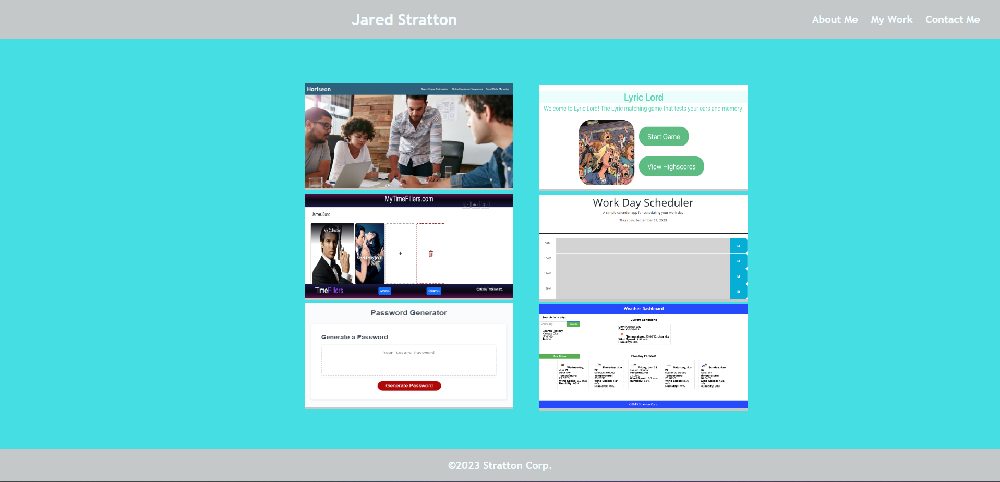

# NA

## Table of Contents

1. [Description](#description)
2. [Usage](#usage)

3. [Installation](#installation)
4. [Contributing](#contributing)

5. [Tests](#tests)

6. [License](#license)

7. [Questions](#questions)

## Description

Personal Portfolio Webpage designed using React technology that introduces the Programmer along with samples of their work and contact information.

## Usage

Portfolio has an About Me, My Work and Contact Me sections which can be viewed to find information and work samples.

Heroku Link: http://react-portfolio-website-54266a770512.herokuapp.com/

## Installation

Not Applicable

## Contributing

Not Applicable

## Tests

Not Applicable

## License

This project is licensed under the [MIT](https://opensource.org/licenses/MIT) license.

## Questions

Find me on GitHub: [EliteHuskie](https://github.com/EliteHuskie)

Contact me at: [EliteHuskie@gmail.com](mailto:EliteHuskie@gmail.com)

